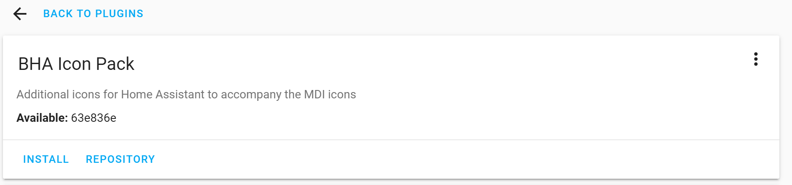
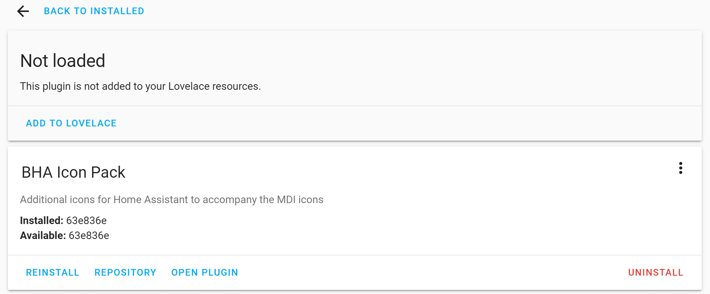

# HACS Install - Step by Step

### Find the plugin and install
<br />
<br />

### Add the plugin to lovelace
<br />

The icons will be available under the aqi namespace, eg aqi:fair

There is no need to restart.

### Systemwide availability (Optional)
The steps above will make the icons available, but limited to the Lovelace UI only. If you want the icons to be available throughout Home Assistant, add the following to the `frontend` section of your `configuration.yaml`

```yaml
frontend:
  extra_module_url:
    - /hacsfiles/hass-aqi-icons/hass-aqi-icons.js
```

For this step, a system restart is needed.
